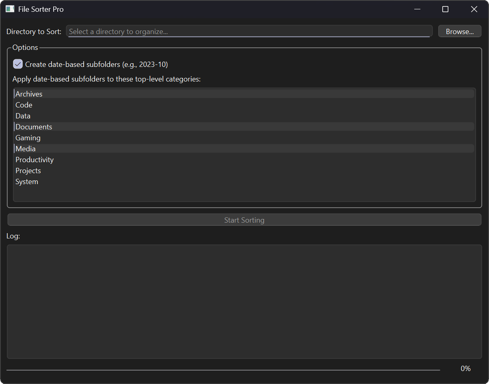

# File Sorter Pro

A user-friendly desktop application with a graphical user interface (GUI) for intelligently organizing files in a directory. It sorts files into categorized and dated subfolders based on their extension, helping you clean up messy folders like "Downloads" with a single click.




## Features

-   **Intuitive GUI:** A simple and clean user interface built with PyQt6. No command line needed.
-   **Intelligent Categorization:** Sorts files into a logical folder structure (e.g., `Media/Images`, `Documents/PDFs`, `Code/Python`) based on their file extension.
-   **Extensive File Type Support:** Comes pre-configured with mappings for hundreds of common file extensions, from images and documents to developer project files, 3D models, and game assets.
-   **Optional Date-Based Sorting:** Automatically create monthly subfolders (e.g., `2024-05`) for specific categories like Media and Documents to keep your photos and files organized chronologically.
-   **Customizable Rules:** You can choose which top-level categories get date-based subfolders directly in the UI.
-   **Safe & Responsive:**
    -   The sorting process runs in a background thread to keep the application responsive and prevent it from freezing.
    -   It safely handles filename conflicts by appending a number (e.g., `file_1.txt`) instead of overwriting existing files.
-   **Detailed Feedback:** A real-time log and a progress bar keep you informed of the entire process, showing which files were moved, renamed, or skipped.

## Requirements

-   Python 3.6+
-   PyQt6

## Installation

1.  **Clone or download the repository:**
    -   Download the `sorter.py` file to your local machine.

2.  **Install the required Python library:**
    -   Open your terminal or command prompt and install `PyQt6` using pip:
    ```bash
    pip install PyQt6
    ```

## How to Use

1.  **Run the application:**
    -   Open your terminal or command prompt, navigate to the directory where you saved the file, and run the script:
    ```bash
    python sorter.py
    ```
    *(Note: On some systems, you might need to use `python3` instead of `python`)*

2.  **Select a Directory:**
    -   Click the **"Browse..."** button and choose the folder you want to organize (e.g., your Downloads folder).

3.  **Configure Options (Optional):**
    -   **Date Subfolders:** Check the box `Create date-based subfolders...` if you want to sort certain files by year and month (e.g., `Media/Images/2024-05`).
    -   **Date Categories:** If you enable date subfolders, you can select which top-level categories (like `Media`, `Documents`, `Archives`) this rule should apply to from the list. You can select multiple categories by holding `Ctrl` (or `Cmd` on Mac) and clicking.

4.  **Start Sorting:**
    -   Click the **"Start Sorting"** button.

5.  **Monitor Progress:**
    -   Watch the log to see which files are being moved.
    -   The progress bar at the bottom will show the overall completion percentage.
    -   When finished, a summary will report the total number of files moved and skipped.

## Customization

You can easily customize the sorting logic by editing the script itself. Open the `.py` file in a text editor to make changes.

### Adding or Changing File Type Mappings

The core of the sorter is the `FILE_TYPE_MAPPINGS` dictionary at the top of the script. The structure is:

```python
".extension": ("TopLevelFolder", "SubFolder", "SubSubFolder", ...),
```

**Example 1: Change where `.zip` files go**

To move `.zip` files to `Archives/Compressed` instead of just `Archives`, change:
```python
# From
".zip": ("Archives",),
```
```python
# To
".zip": ("Archives", "Compressed"),
```

**Example 2: Add a new file type**

Let's say you work with a custom `.notes` file extension and want them sorted into a `Personal/Notes` folder. Simply add a new line to the dictionary:
```python
FILE_TYPE_MAPPINGS = {
    # ... existing mappings
    ".notes": ("Personal", "Notes"),
    # ... more mappings
}
```
The application will automatically pick up these changes the next time you run it. The "Personal" category will also appear in the date-organization list in the UI.

### Changing Default Settings

You can change the default state of the UI by modifying these constants:

-   `DEFAULT_USE_DATE_SUBFOLDERS`: Set to `True` or `False` to determine if the date subfolder checkbox is checked by default.
-   `DEFAULT_DATE_ORGANIZATION_CATEGORIES`: A `set` of strings that defines which categories are selected by default in the date-organization list.

## License

This project is open-source and available under the [MIT License](LICENSE.md).
